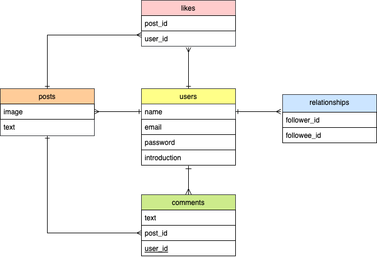
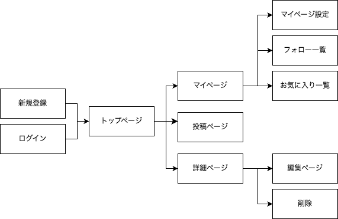

# README
# アプリケーション名 
「Your note」
 
# アプリケーション概要
購入品をシェアし、みんなの「ほしい」がみつかる！
 
# URL
 https://your-note-ffgy.onrender.com
 
# テスト用アカウント
・Basic認証パスワード：1129 
・Basic認証ID：saki 
・メールアドレス：aaa@aaaaa 
・パスワード：aaa111 
 
# 利用方法
## ユーザー管理
トップページのヘッダーメニューから新規登録orログインする

## 投稿機能
1.ログイン後、ヘッダーメニューの「New Post」ボタンから、投稿ページへ遷移 
2.投稿内容（画像、カテゴリー、ハッシュタグ、コンテント）を選択、入力し投稿する 
3.投稿詳細ページから、自身の投稿の編集・削除を行う 

## コメント機能
1.投稿詳細ページで、コメントを投稿する 

## フォロー機能
1.投稿詳細ページなどから、他のユーザーページに遷移 
2.「Follow」ボタンで他のユーザーをフォローする 
3.「Following」ボタンで他のユーザーのフォロー解除する 
4.ユーザーページから「Following list」と「Follower list」を確認できる 

## いいね機能
1.投稿詳細ページから、♡ボタンで他のユーザーの投稿にいいねをする 
2.もう一度押すといいねを解除できる 
3.いいねした投稿は、ユーザーページのwish listから閲覧できる 

## 投稿検索
1.ヘッダーメニューの「Search」ボタンから、検索ページへ遷移 
2.検索フォームでの入力内容と、投稿のコンテンツに合致するものがあれば表示される 

## ユーザ毎のマイページ
1.ユーザーの名前、プロフィールの表示 
2.「wish list」、「Following list」、「Follower list」ボタンから、それぞれ一覧を確認できる 
3.ユーザーの投稿一覧を、クローゼットとして確認できる 
4.犬の画像にホバーすると、撫でているように動くため遊べる 

# アプリケーションを作成した背景
アパレル販売員として働いていたころ、季節の変わり目などに、 
「新しいものがほしいけど、なにがほしいかわからない…」というお客様の悩みを頻繁に聞いていた。 
この悩みは私自身も共感し、ショップを巡っても理想的なアイテムに出会えず、疲れて結局なにも買わずに帰ることがあった。 
そこで、このさみしい気持ちが少しでも解消され、ユーザーそれぞれの「ほしい」に出会えることを願い、このアプリを作成した。 
 
# 洗い出した要件
https://docs.google.com/spreadsheets/d/1bHZZnpBK3rgcD9N2LXnRifG38PFmLfT-LYQd-NZd84g/edit?usp=sharing

# 実装した機能についての画像やGIFおよびその説明
↓ログイン後のトップページ

↓コメント機能

↓いいね機能（非同期処理）、マイページのwish listでいいね一覧を見る

↓フォロー機能（非同期処理）、ユーザーの過去の投稿一覧をクローゼットとして閲覧できる

↓検索機能

↓マイページの犬の画像は、触っているかのように動かして遊べる

  
# 実装予定の機能
現在、検索機能を実装中。 
今後、より複雑な検索機能を実装することで、ユーザーのニーズにさらに適した情報が得られるようにしたい。
 
# データベース設計＊＊

 
# 画面遷移図＊＊

 
# 開発環境
・Ruby on Rails 
・HTML/CSS 
・JavaScript 
・AWS・Render 
・Visual Studio Code 
・GitHub 
 
# ローカルでの動作方法*＊
以下のコマンドを順に実行 
% git clone https://github.com/sakimomo　　　 
% cd ~/projects/your_note　　　 
%  bundle install　　　 
% yarn install　　　 
 
# 工夫したポイント
1.作業工程を分割し、タスク管理ツールを使用した。 
 開発におけるタスクを小分けにすることで進捗管理しやすく、自身のスケジュール管理に役立った。また、作業を細分化したことで、エラーが発生した際には問題の特定と仮説検証を独自に行うことができた。 
2.常にユーザー視点での開発をした。 
 ・いいね数やフォロー数を非表示にした理由は、ユーザーが数字に縛られずリラックスして投稿できるようにするため。 
  使用者がストレスを感じることなく利用できる環境を提供したい。 
 ・既存のSNS上のURLなどから、スマートフォンですぐにアクセスすることを想定してレスポンシブデザインを取り入れた。 
 ・簡素なデザインではなく色彩や動的要素を取り入れることで、利用時に楽しさを感じてもらいたい。 
 
# 改善点
・現在、検索機能は検索ページに遷移することで利用可能だが、トップページですぐに検索できたら便利 
・検索機能において、ハッシュタグやカテゴリーでも検索できると便利 
・他のユーザーのいいね一覧は見えないほうがよいかもしれない 
・ユーザーページに遷移しなくても、投稿詳細ページからフォローできると便利 
・投稿詳細ページを開かなくてもいいねできる仕様だと便利 
（一覧ページで他のユーザーの投稿をホバーした際に、いいねボタンが表示される仕様など） 
・ハッシュタグを何個もつけれると便利 
・メンズ/レディース/選択ナシ　なども検索できたら、異性へのギフトなどをリサーチするのにも活用できそう 
 
# 制作時間
80時間~

# テーブル設計

## usersテーブル
| Column             | Type   | Options                   | 
| ------------------ | ------ | ------------------------- |
| email              | string | null: false, unique: true |
| password           | string | null: false               |
| encrypted_password | string | null: false               |
| name               | string | null: false               |
| profile            | text   | null: false               |

- has_many :comments
- has_many :notes
- has_many :likes
- has_many :active_relationships
- has_many :followings
- has_many :passive_relationships
- has_many :followers

## commentsテーブル
| Column    | Type       | Options                        |
| --------- | ---------- | ------------------------------ |
| content   | text       | null: false                    |
| note      | references | null: false, foreign_key: true |
| user      | references | null: false, foreign_key: true |

- belongs_to :user
- belongs_to :note
- has_many :likes

## notesテーブル
| Column     | Type       | Options                        |
| ---------- | ---------- | ------------------------------ |
| content    | text       | null: false                    | 
| user       | references | null: false, foreign_key: true |
| genre_id   | integer    | null: false                    |
| tag_name   | text       | null: false                    | 

- belongs_to :genre
- belongs_to :user
- has_many :comments
- has_many :tags

## likesテーブル
| Column     | Type       | Options                        |
| ---------- | ---------- | ------------------------------ |
| note       | references | null: false, foreign_key: true |
| user       | references | null: false, foreign_key: true |

- belongs_to :user
- belongs_to :note

## relationshipsテーブル
| Column     | Type       | Options                        |
| ---------- | ---------- | ------------------------------ |
| follower   | references | null: false, foreign_key: true |
| followee   | references | null: false, foreign_key: true |

- belongs_to :following, class_name: "User"
- belongs_to :follower, class_name: "User"

# tagsテーブル
| Column     | Type   | Options                   |
| ---------- | ------ | ------------------------- |
| name       | string | null: false, unique: true |

- has_many :notes
- has_many :note_tag_relations
